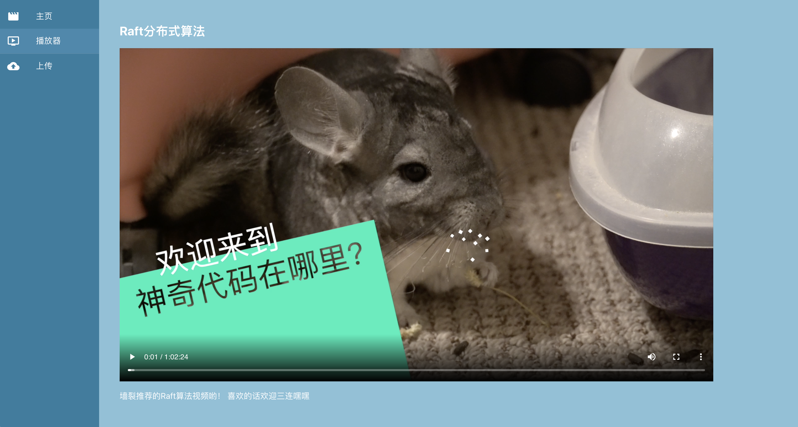
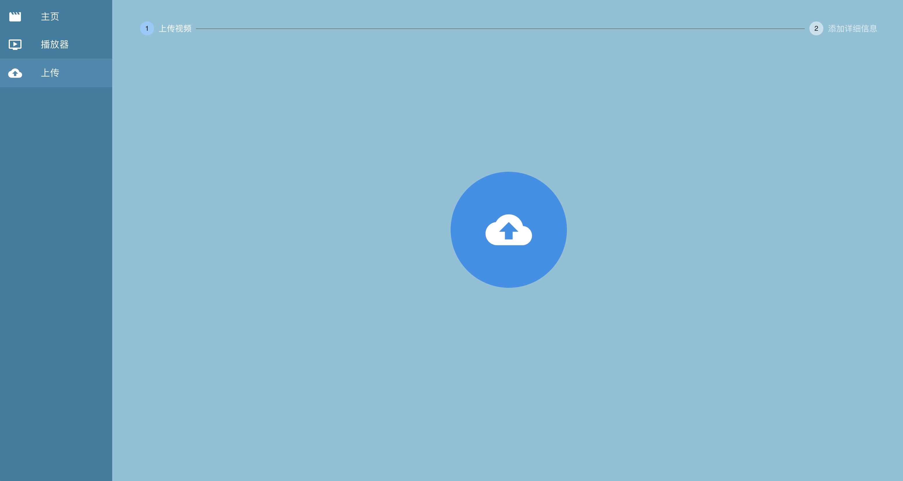

# 这是一个视频网站的前端开发Demo
主要使用到了React + Redux，其中React的UI Framework用的是Material UI。

计划实现从Go的服务器获取所有视频，播放视频，并且上传视频

请配合B站视频食用
## 开发进度： 
- [x] 视频主页UI
- [x] 播放器UI
- [x] 上传按钮 UI + 编辑视频详情UI
- [x] 视频切片+上传业务逻辑
- [x] 接入后端API

## B站视频传送门： 【https://www.bilibili.com/video/BV14q4y1W7qQ?share_source=copy_web 】

## 如何配置环境呢？
yarn install
## 如何运行呢？
yarn start
